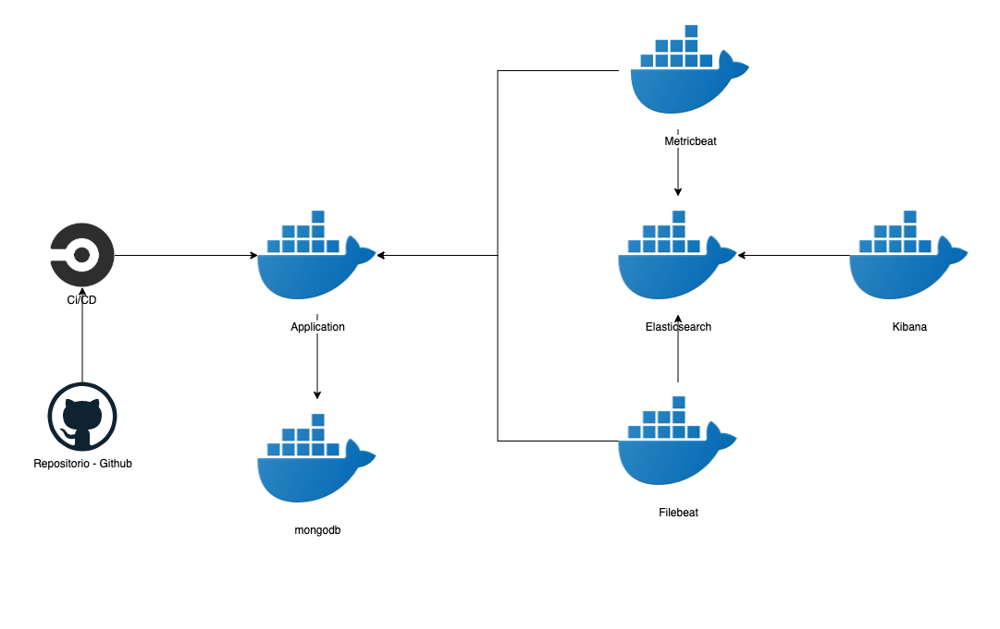
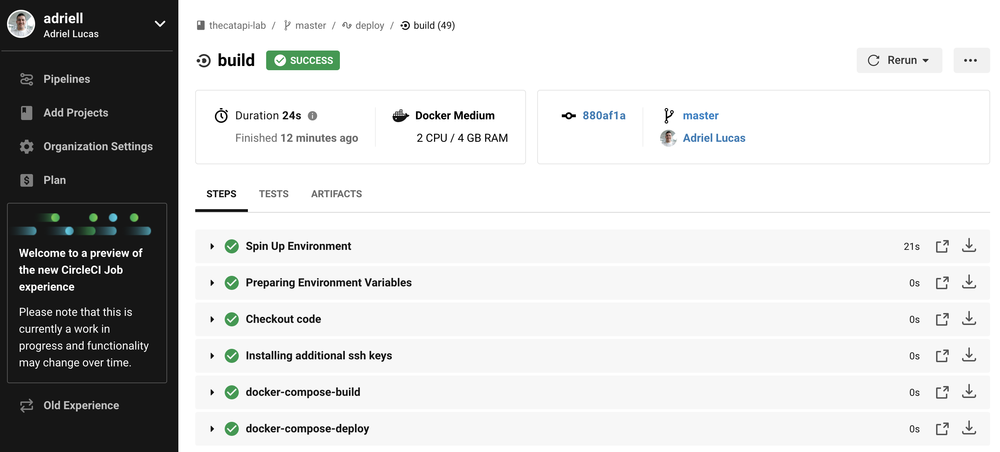
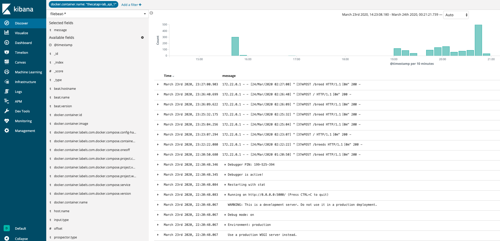
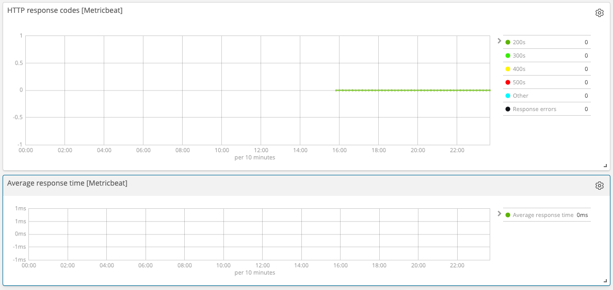

# Implementação em flask python da api The Cat API

Essa é uma implementação de uma API RestFull utilizando a linguagem de programação python com o framework flask, fazendo requests para o a API [TheCatAPI](https://thecatapi.com/).
Está desenhada de acordo com o diagrama abaixo:


## Chamadas da API

`http://localhost:5000/`

A chamada dessa api irá retornar todas as listas de raças dos gatos e suas respectivas informacões e irá armazenar no banco de dados.
```
curl -X POST \
  http://localhost:5000/ \
  -H 'Accept: */*' \
  -H 'Accept-Encoding: gzip, deflate' \
  -H 'Cache-Control: no-cache' \
  -H 'Connection: keep-alive' \
  -H 'Content-Length: 0' \
  -H 'Host: localhost:5000' \
  -H 'Postman-Token: xxxx' \
  -H 'User-Agent: PostmanRuntime/7.20.1' \
  -H 'api-key: xxx' \
  -H 'cache-control: no-cache'
```

`http://localhost:5000/breeds`

Com as informacões no banco de dados, essa api irá retornar todas as raças e suas respectivas informacões, só que apartir do banco de dados.
```
curl -X POST \
  http://localhost:5000/breeds \
  -H 'Accept: */*' \
  -H 'Accept-Encoding: gzip, deflate' \
  -H 'Authorization: xxxxxxx' \
  -H 'Cache-Control: no-cache' \
  -H 'Connection: keep-alive' \
  -H 'Content-Length: 24' \
  -H 'Content-Type: application/json' \
  -H 'Host: localhost:5000' \
  -H 'Postman-Token: xxxx' \
  -H 'User-Agent: PostmanRuntime/7.20.1' \
  -H 'cache-control: no-cache' \
  -d '
```

`http://localhost:5000/breed`

Esta API irá retornar a informação detalhada de apenas uma raça especifica, colocada no json, conforme o comando abaixo.

```
curl -X POST \
  http://localhost:5000/breed \
  -H 'Accept: */*' \
  -H 'Accept-Encoding: gzip, deflate' \
  -H 'Authorization: xxxxxxx' \
  -H 'Cache-Control: no-cache' \
  -H 'Connection: keep-alive' \
  -H 'Content-Length: 24' \
  -H 'Content-Type: application/json' \
  -H 'Host: localhost:5000' \
  -H 'Postman-Token: xxxx' \
  -H 'User-Agent: PostmanRuntime/7.20.1' \
  -H 'cache-control: no-cache' \
  -d '{
	"Name":"Abyssinian"
}'
```

## Tecnologias e ferramentas utilizadas
### Linguagem de programação
```
Python 3.0
Flask
```
Utilizei a linguagem python para fazer essa implementação pois eu tenho mais domínio dessa linguagem e é uma linguagem bastante utilizado pelos sysadmins e SRE`s.


### Hospedagem
```
Docker
Docker Compose
```
Para executar essa api será preciso instalar o [docker](https://docs.docker.com/install/) e o [docker-compose](https://docs.docker.com/compose/install/). 

### Centralização de Logs
```
Elasticsearch
Filebeat
Kibana
```
Essa stack é muito utilizada no mercado e sempre utilizo nos meus trabalhos. Segue o [link](https://www.elastic.co/)

### Monitoramento
```
Metricbeat
```
Também fazendo parte da stack da elastic, o [metricbeat](https://www.elastic.co/beats/metricbeat) ficou responsável pelo monitoramento da API, sendo responsável por monitorar a infraestrutura e os serviços hospedados, aplicacão e banco de dados.


### CI/CD
```
Circleci
```
Para fazer a integração e deploy contínuo, foi utilizado o circleci, por ser uma ferramenta já integrada com o github e não precisa montar uma nova infraestrutura para monitorar a API.

### Banco de Dados

O banco de dados utilizado para essa implementação é o MongoDB. Foi utilizado pois é um banco extremamente leve e fácil utilização, além de ser NoSQl.
Segue o [link](https://www.mongodb.com/) para mais informações.

## Execução da API

A construção da infraestrutura da API foi feita em cima de containers docker, provisionado pelo docker-compose, ferramentas essas que foram descritas anteriormente. Para iniciar a API, basta executar os comandos abaixo.
```
docker-compose build #Comando para buildar todas as imagens da infraestrutura
docker-compose up -d #Comando para iniciar a api e toda sua stack de log e monitoramento.
```
A aplicação irá executar na porta 5000 e para fazer o consumo da API, poderá utilizar a ferramenta postman. Existe uma collection para fazer os testes.

## Deploy

O deploy é feito com CircleCI, quando for realizado push ou merge na master, automaticamente é disparado o job no circleci que faz o deploy em uma máquina da Digital Ocean.
Abaixo as steps do deployment:



## Observability

Essa parte mostra o centralizamento de logs realizado pela estack de logs EFK (Elasticsearch, Logstash e Kibana) e o monitoramento da API realizado pelo metricbeat respectivamente.

A URL de acesso é `http://localhost:5601`. Após acessar o link, será necessário adicionar os índices `metricbeat-*` e o `filebeat-*` no kibana começar visualizar as métricas.


### Centralização de Logs - EFK



### Monitoramento de requests


